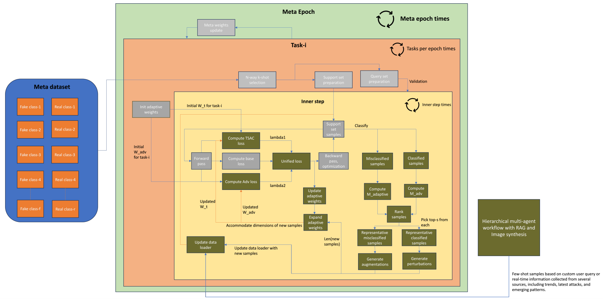
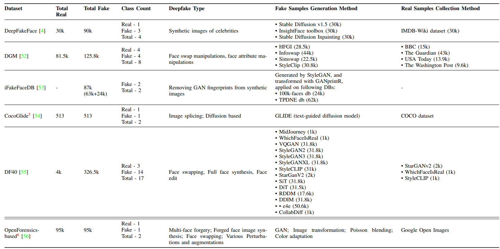
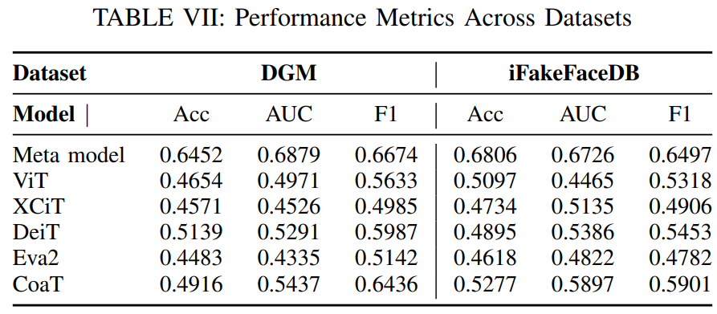

# Adaptive Meta-Learning for Robust Deepfake Detection: A Multi-Agent Framework to Data Drift and Model Generalization

A comprehensive multi-agent framework for adaptive meta-learning-based deepfake detection that addresses data drift and model generalization challenges.


This repository is the codebase for my paper: [Adaptive Meta-Learning for Robust Deepfake Detection: A Multi-Agent Framework to Data Drift and Model Generalization](https://arxiv.org/pdf/2411.08148v1)

## Abstract

Pioneering advancements in artificial intelligence, especially in generative AI, have enabled significant possibilities for content creation, but also led to widespread misinformation and false content. The growing sophistication and realism of deepfakes is raising concerns about privacy invasion, identity theft, and has societal, business impacts, including reputational damage and financial loss. Many deepfake detectors have been developed to tackle this problem. Nevertheless, as for every AI model, the deepfake detectors face the wrath of lack of considerable generalization to unseen scenarios and cross-domain deepfakes. Additionally, adversarial robustness is another critical challenge, as detectors drastically underperform with the slightest imperceptible change. Most state-of-the-art detectors are trained on static datasets and lack the ability to adapt to emerging deepfake attack trends. These three crucial challenges though hold paramount importance for reliability in practise, particularly in the deepfakes domain, are also the problems with any other AI application. This paper proposes an adversarial meta-learning algorithm using task-specific adaptive sample synthesis and consistency regularization, in a refinement phase. By focussing on the classifier’s strengths and weaknesses, it boosts both robustness and generalization of the model. Additionally, the paper introduces a hierarchical multi-agent retrievalaugmented generation workflow with a sample synthesis module to dynamically adapt the model to new data trends by generating custom deepfake samples. The paper further presents a framework integrating the metalearning algorithm with the hierarchical multi-agent workflow, offering a holistic solution for enhancing generalization, robustness, and adaptability. Experimental results demonstrate the model’s consistent performance across various datasets, outperforming the models in comparison. The associated code is available here.

## Overview

This pipeline implements a complete solution for robust deepfake detection using:

1. **RAG Module**: Creates and maintains a persistent vector database from local documents and web-crawled content
2. **Multi-Agent Hierarchical Workflow**: Orchestrates 7 specialized agents to generate deepfake attack patterns and prompts
3. **Sample Synthesis Module**: Generates few-shot samples using Grounding DINO, SAM, and Stable Diffusion
4. **Meta-Learning Framework**: Trains a robust detection model using Reptile meta-learning with few-shot samples, adversarial samples, and augmented samples

## Architecture

Adaptive Meta-learning algorithm (all the olive green blocks are the additions added to the Reptile algorithm)


Hierarchical multi-agent workflow for custom deepfake sample synthesis


## Pipeline

```
┌─────────────────┐
│   RAG Module    │ → Vector DB (Persistent)
└─────────────────┘
         ↓
┌─────────────────┐
│ Multi-Agent      │ → Prompts (Positive & Negative)
│ Workflow         │
└─────────────────┘
         ↓
┌─────────────────┐
│ Sample Synthesis │ → Few-shot Samples Dataset
└─────────────────┘
         ↓
┌─────────────────┐
│ Meta-Learning   │ → Trained Model + Metrics
│ Training        │
└─────────────────┘
```

## Dataset
Meta-Dataset Information -- The pimary dataset used for meta-training 


## Results



## Installation

### Prerequisites

- Python 3.8+
- CUDA-capable GPU (recommended for training and image generation)
- At least 16GB RAM (32GB recommended)

### Setup

1. Clone the repository:
```bash
git clone https://github.com/dineshsrivasthav/adaptive_meta_learning_with_multi_agent_framework.git
```

2. Install dependencies:
```bash
pip install -r requirements.txt
```

3. Set up environment variables:
```bash
# Required for web crawling
export FIRECRAWL_API_KEY="your_firecrawl_api_key"

# Optional: For HuggingFace endpoint access
export HUGGINGFACE_API_TOKEN="your_hf_token"

# Optional: For Cohere reranking
export COHERE_API_KEY="your_cohere_api_key"

# Required for web search tools
export SERPER_API_KEY="your_serper_api_key"
export SERPAPI_API_KEY="your_serpapi_api_key"
export EXA_API_KEY="your_exa_api_key"
```

4. Download required model checkpoints:
   - SAM checkpoint: `sam_vit_h_4b8939.pth` (place in project root)
   - Grounding DINO and Stable Diffusion models will be downloaded automatically

## Usage

### Quick Start: Full Pipeline

Run the complete pipeline end-to-end:

```bash
python main_pipeline.py \
    --user_query "Write 15 Few-shot Prompts to create novel Image deepfakes" (Example) \
    --base_image_dir /path/to/base/images \
    --pdf_folder /path/to/local/docs \
    --run_web_crawl
```

### Step-by-Step Execution

#### 1. RAG Module

Create/update the vector database:

```bash
# From PDFs only
python RAG_workflow.py

# With web crawling (periodic updates)
python web_crawling.py
# Set environment variables:
# PERIODIC_SCAN=true
# SCAN_INTERVAL_HOURS=24
```

#### 2. Multi-Agent Workflow

Generate prompts using the multi-agent system:

```bash
python multiagents.py
# Or set USER_QUERY environment variable
export USER_QUERY="Write 15 Few-shot Prompts to create novel Image deepfakes" #(example)
python multiagents.py
```

#### 3. Sample Synthesis

Generate few-shot samples:

```bash
python sample_synthesis_module.py \
    --user_query "Write 15 Few-shot Prompts to create novel Image deepfakes" \
    --base_image_dir /path/to/base/images \
    --output_dir ./few_shot_samples \
    --max_samples 15
```

#### 4. Meta-Learning Training

Train the meta-learning model:

```bash
python meta_learning+adv+aug_sample_generation.py \
    --train_real_path /path/to/train/real \
    --train_fake_path /path/to/train/fake \
    --val_real_path /path/to/val/real \
    --val_fake_path /path/to/val/fake \
    --few_shot_samples_path ./few_shot_samples \
    --num_meta_epochs 30 \
    --tasks_per_epoch 10
```

### Configuration

Create a `config.json` file for custom configuration:

```json
{
    "vector_db_path": "./chroma_db",
    "pdf_folder": "/path/to/local/docs",
    "multiagent_output_dir": "./outputs",
    "few_shot_samples_dir": "./few_shot_samples",
    "train_real_path": "/path/to/train/real",
    "train_fake_path": "/path/to/train/fake",
    "val_real_path": "/path/to/val/real",
    "val_fake_path": "/path/to/val/fake",
    "model_save_path": "./trained_model.pth",
    "num_meta_epochs": 30,
    "tasks_per_epoch": 10,
    "text_prompt": "person face",
    "mask_type": "normal",
    "max_samples": null,
    "deep_crawl": false
}
```

## Module Details

### Module A: RAG Workflow

- **Purpose**: Create and maintain a persistent vector database capturing deepfake attack related trends
- **Inputs**: Local PDF documents (for custom set of information), web-crawled content (collected within the workflow for global trends, and new attacks)
- **Outputs**: Persistent ChromaDB vector database with ensemble retriever
- **Key Features**:
  - Semantic chunking of documents
  - Hybrid search (vector + BM25)
  - Optional Cohere reranking
  - Persistent storage

### Module B: Multi-Agent Hierarchical Workflow

- **Purpose**: Generate positive and negative prompts for custom deepfake attack embedded sample generation
- **Agents**:
  1. **QueryStrategist** (Llama 3.1 8B): Creates comprehensive query lists
  2. **DataCollector** (Llama 3.1 8B): Gathers relevant information
  3. **ReportGenerator** (Zephyr 7B): Creates comprehensive reports
  4. **InfoRefiner** (Zephyr 7B): Refines and deduplicates information
  5. **AttackPatternSynthesizer** (Mistral NeMo Minitron 8B): Synthesizes attack patterns leveraging curated information
  6. **PromptGenerator** (Qwen 7B): Generates image generation prompts
  7. **Manager** (Llama 3.1 8B): Orchestrates the workflow
- **Outputs**: Positive and negative prompts

### Module C: Sample Synthesis

- **Purpose**: Generate multi-deepfake patterened few-shot image samples
- **Inputs**: Prompts from multi-agent workflow
- **Process**:
  1. Object detection using Grounding DINO
  2. Segmentation using SAM
  3. Deepfake patterened image generation using Stable Diffusion inpainting
- **Outputs**: Few-shot samples dataset with metadata

### Module D: Meta-Learning Training

- **Purpose**: Train a robust deepfake detection model
- **Algorithm**: Adaptive meta-learning
- **Inputs**: 
  - Meta-learning dataset (train/val real and fake)
  - Few-shot generated samples
  - Adversarial samples (generated during training)
  - Augmented samples (generated during training)
- **Outputs**: Trained model and performance results

## Model Assignments

The multi-agent system uses different models optimized for specific tasks:

- **Llama 3.1 8B**: Query generation, data collection, orchestration
- **Zephyr 7B**: Report generation, information refinement
- **Mistral NeMo Minitron 8B**: Technical synthesis, attack pattern generation
- **Qwen 7B**: Creative tasks, prompt generation

Models can be used via:
- Local HuggingFace pipelines (default)
- HuggingFace endpoints (set `USE_HF_ENDPOINT=true`)

## File Structure

```
.
├── RAG_workflow.py              # RAG module for vector DB
├── web_crawling.py               # Web crawling and content addition
├── Tools.py                      # Tools for multi-agent system
├── multiagents.py                # Multi-agent hierarchical workflow
├── sample_synthesis_module.py   # Few-shot sample generation
├── meta_learning+adv+aug_sample_generation.py  # Adaptive meta-learning training
├── main_pipeline.py              # Main orchestrator
├── requirements.txt              # Python dependencies
├── README.md                     # This file
└── config.json                   # Configuration file (customize as needed)
```

## Output Directories

- `./chroma_db/`: Persistent vector database
- `./outputs/`: Multi-agent workflow outputs
- `./few_shot_samples/`: Generated few-shot samples
- `./trained_model.pth`: Trained meta-learning model
- `./pipeline_results.json`: Pipeline execution results


## Citation

If you use this code/work, please cite the research paper "Adaptive Meta-Learning for Robust Deepfake Detection: 
A Multi-Agent Framework to Data Drift and Model Generalization":

```
@misc{p2024adaptivemetalearningrobustdeepfake,
      title={Adaptive Meta-Learning for Robust Deepfake Detection: A Multi-Agent Framework to Data Drift and Model Generalization}, 
      author={Dinesh Srivasthav P and Badri Narayan Subudhi},
      year={2024},
      eprint={2411.08148},
      archivePrefix={arXiv},
      primaryClass={cs.AI},
      url={https://arxiv.org/abs/2411.08148}, 
}
```

